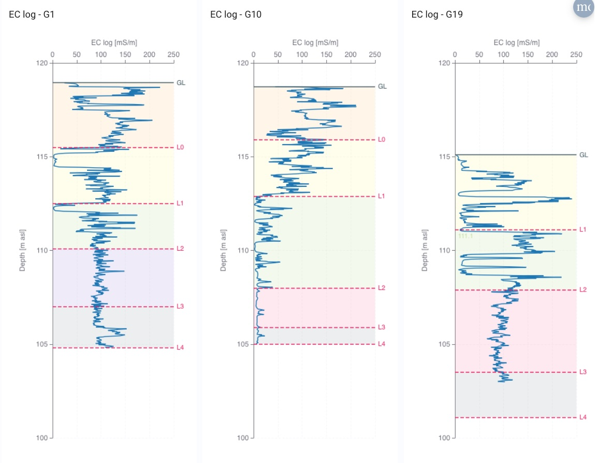

# Custom XY Chart

A custom [ThingsBoard](https://thingsboard.io/) widget that plots one array of values against another as an **X–Y line or scatter chart**, built on [Apache ECharts](https://echarts.apache.org/) (v5, loaded from CDN at runtime).

Unlike a standard time-series widget, this one does **not** plot telemetry against time. It reads the *latest value* of each data key and expects that value to be an **array** (or a JSON string that parses to one). It then pairs the X array and Y array element-by-element into points. This makes it well suited to **vertical profiles and crossplots** — for example electrical conductivity versus depth, or temperature versus depth — where both variables are stored as arrays on a single record.

## Features

- **Array-based plotting** — pairs the X and Y arrays index-by-index (`[x[i], y[i]]`); series length is the shorter of the two.
- **Line or scatter** rendering, with optional smoothing and configurable symbol size, line width, and colour.
- **Dual Y axis** — an optional second series on an independent Y axis, positioned left or right, with its own scale, label, and style.
- **Log scales** on any axis (X, Y1, Y2).
- **Inverted axes** — useful for depth profiles where the Y axis should increase downward.
- **Manual or auto axis ranges** (min/max per axis).
- **Threshold lines** — dashed/solid marker lines bound to the X, Y1, or Y2 axis, each with its own colour and label.
- **Shaded bands** — coloured background regions bound to the X, Y1, or Y2 axis, with adjustable opacity and label.
- **Crosshair tooltip** showing the paired X and Y values, labelled per series.
- **Diagnostic placeholder** — when the primary arrays aren't ready, the widget shows a "Waiting for data…" panel that reports what each subscribed key actually returned (type and length), which makes datasource misconfiguration easy to spot.

## Data model — important

Each configured data key must resolve, at its latest timestamp, to an **array of numbers** (either a native array or a string like `"[0.5, 0.7, 1.1]"` that parses as JSON). The widget takes `data[0][1]` for each key, JSON-parses it if it's a string, and treats it as the series array.

- `xKey` → array of X values
- `yKey` → array of Y values

A typical profile plot stores, for one well and timestamp, a `depth_m` array and an `ec_mscm` array of equal length.

## Settings

### Data keys

| Setting | Description | Default |
| --- | --- | --- |
| `xKey` | Name of the data key holding the X array | `x` |
| `yKey` | Name of the data key holding the Y array | `y` |
| `x2Key` | X array for the secondary series (falls back to `xKey` if empty) | `xKey` |
| `y2Key` | Y array for the secondary series | _(none)_ |
| `y2Enabled` | Enable the secondary series and second Y axis | `false` |

### X axis

| Setting | Description | Default |
| --- | --- | --- |
| `xLabel` | Axis title (also used in the tooltip) | _(empty)_ |
| `xLog` | Use a logarithmic scale | `false` |
| `xInverse` | Reverse the axis direction | `false` |
| `xOnTop` | Place the axis at the top instead of the bottom | `false` |
| `xMin` / `xMax` | Manual axis range | _auto_ |

### Primary series (Y1)

| Setting | Description | Default |
| --- | --- | --- |
| `yLabel` | Y1 axis title | _(empty)_ |
| `yLog` | Logarithmic scale | `false` |
| `yInverse` | Reverse direction (e.g. depth increasing downward) | `false` |
| `yMin` / `yMax` | Manual range | _auto_ |
| `showLine` | Draw a line; set `false` for scatter only | `true` |
| `showSymbol` | Show data-point markers | `true` |
| `symbolSize` | Marker size (px) | `4` |
| `lineWidth` | Line width (px) | `1.5` |
| `color` | Series colour | `#1f77b4` |
| `smooth` | Smooth the line | `false` |

### Secondary series (Y2) — only when `y2Enabled` is true

| Setting | Description | Default |
| --- | --- | --- |
| `y2Label` | Y2 axis title | _(empty)_ |
| `y2OnRight` | Place Y2 on the right; set `false` for left | `true` |
| `y2Log` | Logarithmic scale | `false` |
| `y2Inverse` | Reverse direction | `false` |
| `y2Min` / `y2Max` | Manual range | _auto_ |
| `y2ShowLine` | Draw a line; set `false` for scatter | `true` |
| `y2ShowSymbol` | Show markers | `true` |
| `y2SymbolSize` | Marker size (px) | `4` |
| `y2LineWidth` | Line width (px) | `1.5` |
| `y2Color` | Series colour | `#e91e63` |
| `y2Smooth` | Smooth the line | `false` |

### Threshold lines (`thresholds`)

An array of objects (or JSON strings). Each draws a marker line:

| Field | Description | Default |
| --- | --- | --- |
| `value` | Position on the bound axis (required, numeric) | — |
| `axis` | Which axis to bind to: `x`, `y`, or `y2` | `y` |
| `color` | Line colour | `#e91e63` |
| `style` | Line type: `solid`, `dashed`, `dotted` | `dashed` |
| `label` | Text shown at the line end | the value |

### Shaded bands (`bands`)

An array of objects (or JSON strings). Each fills a region between two values:

| Field | Description | Default |
| --- | --- | --- |
| `from` / `to` | Region bounds on the bound axis (required, numeric) | — |
| `axis` | Which axis to bind to: `x`, `y`, or `y2` | `y` |
| `color` | Fill colour | `#4caf50` |
| `opacity` | Fill opacity (0–1) | `0.2` |
| `label` | Optional label drawn at the top-left of the band | _(none)_ |

## Installation

1. In ThingsBoard, open **Resources → Widgets Library**.
2. Open the target widget bundle (or create a new one).
3. Click **Import widget** and select `custom-xy-chart.json`.
4. The widget now appears in the bundle and can be added to any dashboard.

## Usage

1. Add the widget to a dashboard.
2. In the widget **Datasource**, select the entity (e.g. monitoring well `G19`) and add the data keys whose latest values are the X and Y arrays.
3. In **Advanced settings**, set `xKey` / `yKey` to those key names, add axis labels, and configure ranges, scales, thresholds, and bands as needed.
4. For a profile plot, set the depth key as `yKey` and enable `yInverse` so depth increases downward.

If the chart shows **"Waiting for data…"**, read the subtext — it lists each subscribed key and what it returned (e.g. `array(120)`, `string("…")`, or `null/missing`), which usually points straight at the misconfigured key or a value that isn't a valid array.

## Requirements

- Loads ECharts v5 from `cdn.jsdelivr.net` at runtime, so the browser viewing the dashboard needs outbound access to that CDN.

## Data source

Developed for groundwater monitoring in the Dresden / Pirna area (Elbtal aquifer), for plotting vertical profiles and crossplots from array-valued records.

## License

See the [LICENSE](../../LICENSE) file in the repository root.
