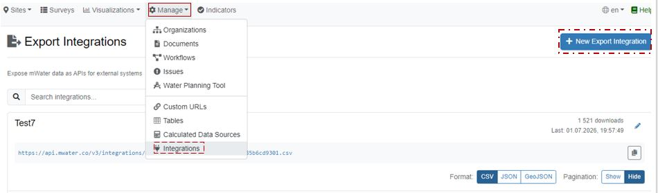
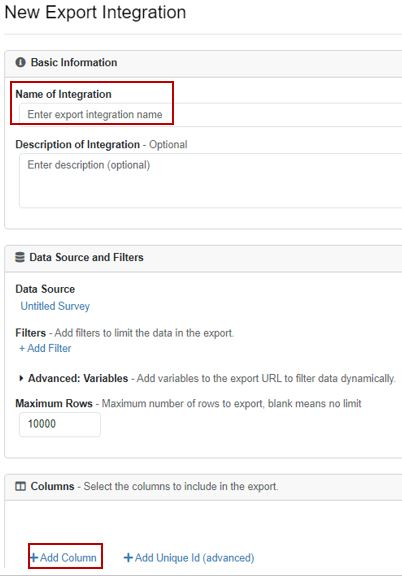
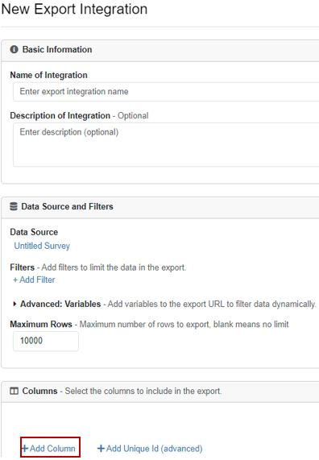
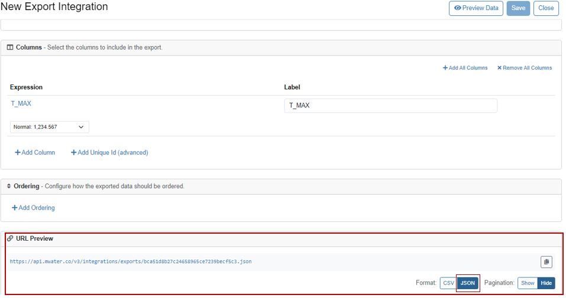
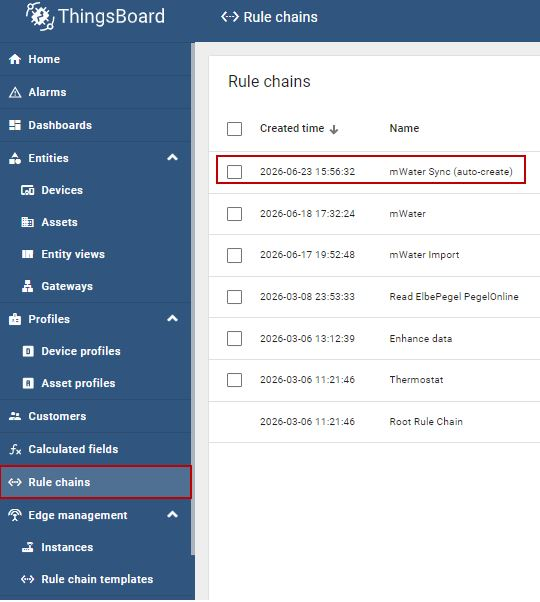
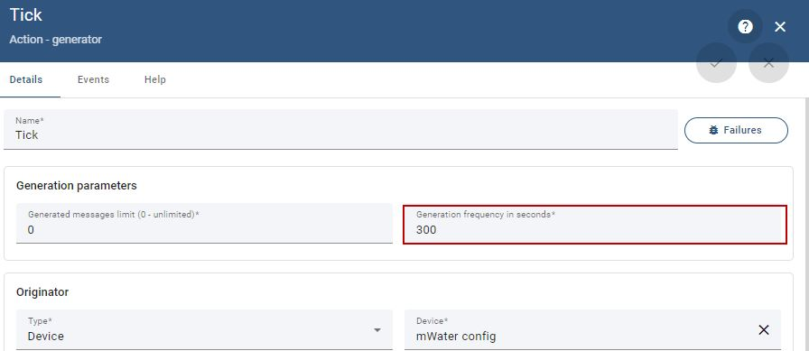
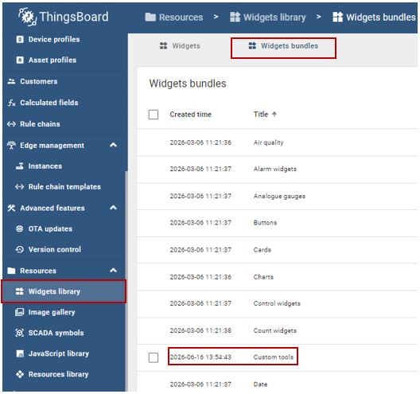

# mWater → ThingsBoard Sync

Automatic transfer of measurement data from **mWater** into **ThingsBoard**
(`dashboards.inowas.org`), running server-side on a timer — no manual exports,
no scripts to run, nothing that has to stay open in a browser.

This repository contains everything needed to operate, restore or rebuild the setup:
the rule chain, the configuration widget, the node scripts and the full guide.

---

## How it works

```
mWater  ──►  Rule chain  ──►  Devices  ──►  Dashboards
JSON export   mWater Sync      one per       charts /
link          (auto-create)    measurement   tables
                               point
```

A rule chain inside ThingsBoard downloads each mWater export on a timer, converts the
dates, and writes the rows as time series. Devices that do not exist yet are created
automatically.

### The four components

| Component | What it is | Where to find it |
|---|---|---|
| **`mWater config`** device | A normal device used only as a shelf. Holds the dataset list in a server attribute called `datasets`. No telemetry is ever written to it. | Entities → Devices |
| **`datasets`** attribute | A JSON array — one entry per dataset (export URL, target device, date column, point column, sync flag). | `mWater config` → Attributes → Server scope |
| **`mWater Sync (auto-create)`** | The rule chain. Reads the list on a timer, downloads each export, converts dates, writes telemetry, creates missing devices. | Entities → Rule chains |
| **The widget** (`IMPORTER`) | A small editor for the `datasets` attribute. It does not move any data itself. | Resources → Widgets library → Custom tools |

> **Rule of thumb:** the widget only edits a list. All the real work happens in the
> rule chain. If data stops arriving, look at the rule chain — not the widget.

### Requirements

- **Tenant administrator rights** in ThingsBoard. Without them the widget cannot read or
  write the list, and the rule chain cannot create devices.
- The mWater export link must be **JSON** (not CSV) and reachable from the internet.
- No access token has to be copied anywhere — the widget uses the browser session and
  refreshes it automatically.

---

## Repository contents

```
rule-chain/
  mwater-sync-auto-create.json     Rule chain export — import into ThingsBoard as-is
widget/
  importer-widget-export.json      Full widget export — import into a widgets bundle
  widget.html                      HTML tab (layout only)
  widget.css                       CSS tab (styling)
  widget.js                        JavaScript tab (logic)
scripts/
  rule-nodes/                      The scripts inside the rule chain nodes
  create_point_devices.py          Optional helper (not needed in normal operation)
examples/
  datasets.example.json            What the datasets attribute looks like
docs/
  images/                          Screenshots used in this guide
  mWater_ThingsBoard_Maintenance_Guide.pdf   Same guide as a printable PDF
```

---

## 1. Create the export link in mWater

Every dataset needs its own export link. This is done once per dataset.

**1.** In mWater, open **Manage → Integrations**, then click **+ New Export Integration** (top right).



**2.** Give the integration a **name**, then add the columns you need with **Add Column**:
the date column, the point column (only if the dataset contains several measurement points),
and the measured parameters.



**3.** Check **Maximum Rows**. Leave it **empty** to export the full history — a value here
silently truncates the export.



**4.** Scroll to **URL Preview**, switch the format to **JSON**, copy the link, and **Save**
the integration.



> Paste the link into a browser to check it: it must show a JSON array (text starting with a
> square bracket). If a file downloads instead, or you see a comma-separated table, the format
> is still CSV and the rule chain will not be able to read it.

---

## 2. Add a dataset with the widget

The widget writes your entry into the `datasets` list. The rule chain picks it up on its next run.

### Choosing the mode

- **Single device** — the dataset contains one measurement point (or you want everything in
  one device). Fill in **Device name**. Leave the point column empty.
- **Split by point** — the dataset contains many measurement points in one table. Fill in
  **Point column** with the name of the column holding the point name (for example `Name`).
  Each point then gets its own device, named after the point. **Prefix** is optional and is
  put in front of every device name.

### Fields

| Field | Meaning |
|---|---|
| mWater JSON export URL | The link from section 1. |
| Date column | Name of the column holding the date, e.g. `Date`, `Time` or `submitted on`. Both Excel serial numbers and normal date/time text are understood. |
| Point column | Only in *Split by point*: the column that names the measurement point. |
| Device name / Prefix | Target device (single mode) or optional name prefix (split mode). |
| sync | On: the dataset is transferred on every run. Off: the rule chain skips it. |

### Buttons

- **Add dataset** — adds the entry to the table on screen. Nothing is stored yet.
- **Save** — writes the list to ThingsBoard. **Changes only take effect after Save.**
- **Reload** — re-reads the stored list and discards unsaved edits.

> **Historical data:** a dataset that never changes (for example a 30-year climate series)
> only has to be transferred once. When the data has arrived, switch **sync** off and press
> Save. The rule chain then stops re-uploading thousands of points on every run. Switch it
> back on when new rows are added in mWater.

### Checking that it worked

1. Wait for one run of the rule chain (see the Tick period in section 3).
2. Open **Entities → Devices**. In split mode the point devices appear automatically, with
   device type `mWater point`.
3. Open one device → **Latest telemetry**. The measured parameters must be listed there.
4. For the history, add a chart and set the time window wide enough to cover the dates in the
   data. The default window only shows the last few hours, which looks empty for historical series.

---

## 3. The rule chain

The chain is called **mWater Sync (auto-create)** and lives under **Entities → Rule chains**.
It runs on the server, so nothing has to be open in a browser.



### What each node does

| Node | Function |
|---|---|
| **Tick** | Timer. Starts one run. Its *originator* must be the `mWater config` device, because the next node reads the list from the originator. |
| **Load datasets** | Reads the server attribute `datasets` from the originator. |
| **Split datasets** | Turns the list into one message per dataset and skips entries whose sync flag is off. |
| **Fetch mWater** | Downloads the export URL (GET). |
| **Split rows** | Splits the downloaded array into single rows. **Required:** script nodes reject any input larger than 100,000 characters. |
| **Transform** | Per row: converts the date into a timestamp, decides the target device name, builds the telemetry values. |
| **Has device** | Filter. Drops rows with an empty or unwanted point name, so no junk devices are created. |
| **Create + route to device** | Creates the target device if it does not exist yet, and sends the row to it. |
| **save** | Writes the time series. |

### Changing how often the transfer runs

Open the **Tick** node and edit **Generation frequency in seconds**. Use `86400` (once a day)
for normal operation, or a smaller value while testing. **Do not go below about two or three
minutes:** each run re-uploads all rows of every active dataset, and runs would start to overlap.



After changing anything in a node, apply the node and then **save the rule chain**.

---

## 4. Troubleshooting

Almost every problem is found the same way: run the chain with debug on and look at the
**Events** tab of each node, from left to right. The first node without outgoing events is
where it stops.

### How to read the events

1. Open the rule chain, double-click a node, switch debug from *Failures* to **all messages**,
   and save the chain.
2. Wait for one Tick period.
3. Open the **Events** tab of each node in order: Tick → Load datasets → Split datasets →
   Fetch mWater → Split rows → Transform → Has device → Create + route → save.
4. In a row, **Data** shows the message content, **Metadata** shows values such as the URL and
   the target device, and **Error** shows the failure text.

> Full debug logging switches itself off after about 15 minutes. Empty event lists usually mean
> debug expired — not that the chain has stopped. Turn debug on again right before testing.

### Common problems

| Symptom | Cause and fix |
|---|---|
| Widget says *Save failed: Token has expired* | The browser session expired. Reload the dashboard page and press Save again. If it repeats, log out and back in. |
| Widget saves, but no data appears | Check the export link in a browser first. Then check the Events of **Fetch mWater**: if there is no response, the URL is wrong or not public. A local file path (`D:\...`) can never work — the chain runs on the server. |
| *Script input arguments exceed maximum allowed total args size* | The **Split rows** node is missing or bypassed. Reconnect Fetch mWater → Split rows → Transform. |
| Data lands with wrong dates | Wrong **Date column** in the dataset entry. Correct it in the widget and save. Note that `submitted on` is the upload time, which is not always the measurement date. |
| Only part of the history arrives | The mWater export is truncated or paginated. Clear **Maximum Rows** in the integration and check that pagination is hidden in the URL preview. |
| Junk devices appear | Rows with an unusual point name. Extend `SKIP_POINTS` in the **Transform** node (`scripts/rule-nodes/03-transform.js`). |
| Nothing runs at all | Check the **Tick** node: its originator must point at an existing `mWater config` device. If that device was deleted or recreated, see section 5. |

---

## 5. Repairing the system

### If the `mWater config` device was deleted

This is the only part that is not rebuilt automatically. Everything else (point devices and
their data) is recreated by the rule chain from mWater.

1. Create a device named **`mWater config`** (Entities → Devices → Add device). The device
   type does not matter.
2. Copy its **id** from the device card — a new device always gets a new id.
3. Open the rule chain, edit the **Tick** node, and set *Originator* to Device → `mWater config`
   (pick it from the list). Apply and save the chain.
4. Open the widget, replace the id in the first line of the JavaScript tab
   (`CONFIG_DEVICE_ID`), press **Run**, then **Save**. If the widget is already on a dashboard,
   remove it and add it again.
5. Enter the datasets again in the widget and press Save — or paste a saved copy of
   `datasets` straight into the attribute. The attribute is created automatically.
6. Wait for one or two runs: the point devices reappear and the history is re-uploaded from mWater.

> **Keep a backup of the list.** The `datasets` attribute is the only piece of information that
> cannot be recovered from mWater. Copy its text (plain JSON) into this repository whenever it
> changes — see `examples/datasets.example.json` for the shape.

### If the rule chain was deleted or broken

Import `rule-chain/mwater-sync-auto-create.json` (Entities → Rule chains → import).
Then open the **Tick** node and point its originator at the current `mWater config` device —
the id stored in the file is only valid for the instance it was exported from.

### If the widget stops loading

- Import `widget/importer-widget-export.json` into a widgets bundle, or paste the three files
  (`widget.html`, `widget.css`, `widget.js`) into the matching tabs.
- **Style rules must stay in the CSS tab.** Curly brackets inside the HTML tab break the
  Angular template compiler — this is the cause of *"Failed to compile widget html"*.
- The HTML tab must stay small. Very large pasted content (for example base64 images) can fail
  to paste silently, leaving the old code in place.
- After editing, press **Run** to compile, then **Save**. A widget already placed on a dashboard
  keeps an older copy: remove it from the dashboard and add it again to pick up changes.



---

## 6. Deleting data — read before you click

Deleting devices in ThingsBoard is **irreversible from the interface**: the device and all of
its time series are removed from the database. There is no undo and no recycle bin.

- Never use *filter + select all + delete*. Filters can match more than you expect, and the
  selection may include devices that are not visible on the current page.
- Delete devices **one by one**, checking each name.
- Before any bulk clean-up, export the affected data and tell the other users of the instance.
- Server-side database backups exist, but they are a last resort: restoring means rolling the
  whole database back to an earlier state, and retention is limited to a few days.

---

## Appendix: node scripts

The scripts inside the rule chain are kept in `scripts/rule-nodes/` so they can be pasted back
into a rebuilt node. All are JavaScript — set *Script language* to **JS** in the node.

| File | Node |
|---|---|
| `01-tick.js` | Tick (generator) |
| `02-split-datasets.js` | Split datasets |
| `03-transform.js` | Transform |
| `04-has-device.js` | Has device (filter) |

**Create + route to device** is configured in the interface, not by script. The settings that
matter: entity type **Device**, name pattern `${device}`, *create entity if it does not exist*
enabled, and *change originator to the related entity* enabled.

`scripts/create_point_devices.py` is an **optional** helper that pre-creates one device per
measurement point from a local export file. It is not part of normal operation — the rule chain
creates devices by itself.
